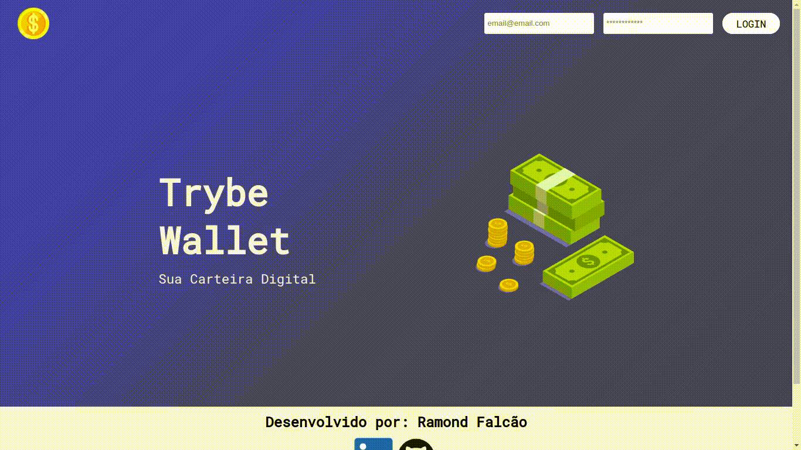

#  <a href="https://ramondfalcao.github.io/trybe-wallet/"><h1 align="center">Projeto Trybe Wallet em React com Redux!</h1></a>

## O que foi desenvolvido

Neste projeto desenvolvi uma carteira de controle de gastos com conversor de moedas, ao utilizar essa aplicação um usuário deverá ser capaz de:

- Adicionar, remover e editar um gasto;
- Visualizar uma tabelas com seus gastos;
- Visualizar o total de gastos convertidos para uma moeda de escolha;

# Habilidades

Neste projeto, fui capaz de:

- Criar um store Redux em aplicações React

- Criar reducers no Redux em aplicações React

- Criar actions no Redux em aplicações React

- Criar dispatchers no Redux em aplicações React

- Conectar Redux aos componentes React

- Criar actions assíncronas na sua aplicação React que faz uso de Redux.

## 🛠 Tecnologias

As seguintes ferramentas foram usadas na construção do projeto:

- [ReactJs](https://pt-br.reactjs.org/)
- [Javascript](https://developer.mozilla.org/en-US/docs/Web/JavaScript)
- [Css](https://developer.mozilla.org/en-US/docs/Web/CSS)
- [Redux](https://redux.js.org/)

## Instruções para abrir a aplicação
[Link Da Aplicação](https://ramondfalcao.github.io/trybe-wallet/)

1. Clone o repositório
  * `git clone git@github.com:ramondfalcao/trybe-wallet.git`
  * Entre na pasta do repositório que você acabou de clonar:
    * `cd trybe-wallet`

2. Instale as dependências e inicialize o projeto
  * Instale as dependências:
    * `npm install`
  * Inicialize o projeto:
    * `npm start` (uma nova página deve abrir no seu navegador)
---

<h4 align="center"> 
	🚧  Botão "Editar" 🚀 Em construção...  🚧
</h4>
